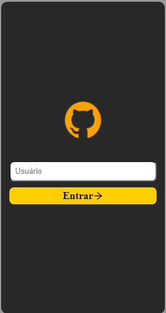

# challengeReact
Aplicação simples usando ReactJS, Router e Redux; que lista informações sobre algum perfil do github, como seguidores, repositórios e pessoas a quem segue. 

Página inicial  

Página principal de usuário  

Página da lista de repositórios do usuário  

